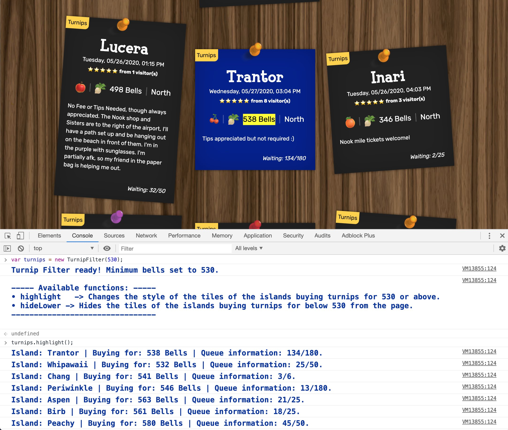
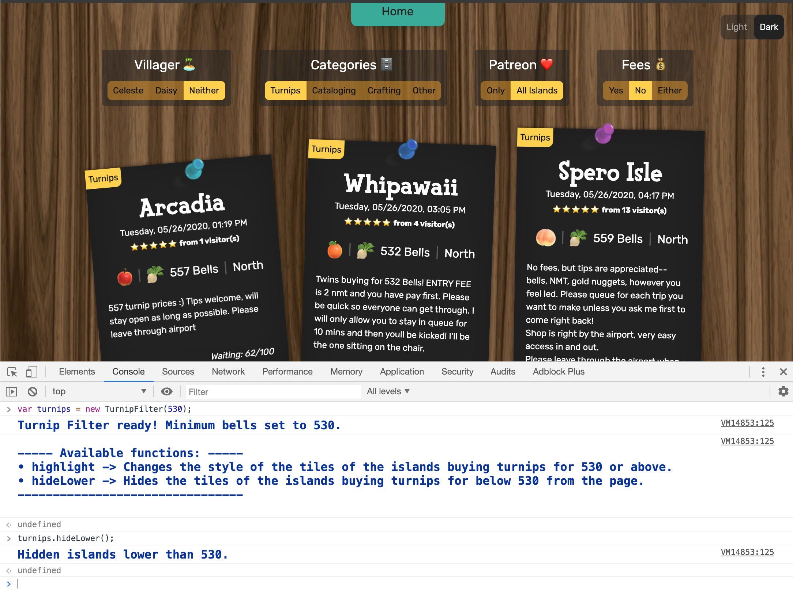

# **Turnip Exchange filter script**

The [Turnip Exchange site](https://turnip.exchange/islands) doesn't currently allow you to filter by Bells.

This script allows you to:
- Highlight the islands that are buying for the specified `minimumBells` and above.
- Hide the islands that are buying for lower than the specified `minimumBells`.

---

## **Setup:**
- Copy the code in `index.js`
- Go to https://turnip.exchange/islands
- Make sure you have "categories" set to "turnips"
- Open the dev console: right click and click `inspect`, click on the `console` tab
- Paste the code into the console and press enter.

---

## **Usage:**
Instantiate a new instance passing in the minimum amount of bells you want to sell for.

Minimum bells defailts to 500 if you don't specify a number.

```javascript
var turnips = new TurnipFilter(550); // << Minimum Bells = 550.
```

### **Highlight the islands buying for the minimum amount and above.**
```javascript
turnips.highlight();
```



### **Hide the islands buying for less than the minimum amount.**
```javascript
turnips.hide();
```

